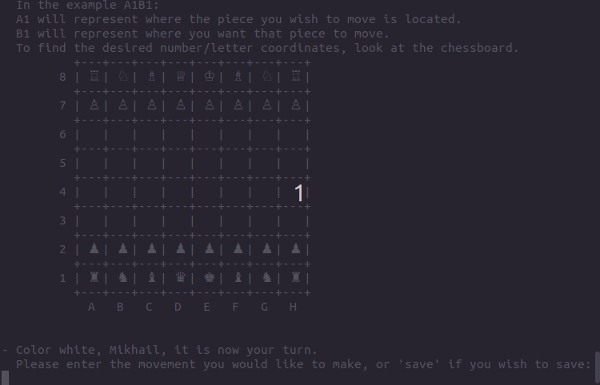

# Chess

This is the a linux command line game of Chess, creating to include all main game features including En Passant, Castling, Check, and Checkmate. Players can play against each other, against a computer, or watch two computers battle it out. As you can see in the demo below, computers will prioritise movements resulting in a check or checkmate, and if they can't perform one they'll prioritize attacking an enemy piece!

## Table of Concepts

- [Overview](#overview)
- [My Process](#my-process)
    - [Challenges](#challenges)
    - [What I learned](#What-i-learned)
    - [Continued Development](#continued-development)
    - [Instructions](#instructions)
- [Author](#author)

## Overview

This is the a linux command line game of Chess, creating to include all main game features including En Passant, Castling, Check, and Checkmate. Players can play against each other, against a computer, or watch two computers battle it out. As you can see in the demo below, computers will prioritise movements resulting in a check or checkmate, and if they can't perform one they'll prioritize attacking an enemy piece!

You can play the game online by [clicking on this replit link](https://replit.com/@mgrig92/chess#.replit), and then pressing the green `Run` button.

## My Process

A large aim for this project was to become comfortable with not only testing but also with writing code in an object oriented manner. I began by spending a week reading [Principles of Object Oriented Design](https://www.poodr.com/) and [99 Bottles of OOP](https://sandimetz.com/99bottles), which are both phenomenal books. I drew out multiple UML diagrams as I thought about the messages that would be sent, and how those would influence the structure of my project. I decided on creating a structure that seperated the piece logic, from the player's input, the terminal display, and the game logic. 

Once I had a plan in mind, I began writing code in a TDD manner starting with the simplest problem I could think of: Making a Rook move in one direction. From there I expanded into attacks, made my way through all of the movements and attacks for every piece on the game board, and moved into more complicated game logic. 

### Challenges

- Problem: What should I work on first?

    - Solution:  In a project of this scope it was hard to decide what problem to tackle first, and it was thanks to the books I read that I settled on what appeared to be the simplest - Rook movement - even though I *wanted* to dive into Check/Checkmate logic.
  
- Problem: How can I make sure my program is well tested?

    - Solution: Use test-driven development whenever possible, and avoid using doubles - instead relying on incorporating actual objects in tests to perform integration testing. 
   
    
### What I learned

As projects grow in scope and complexity, some things become essential if a developer wants to avoid pulling out their hair:
- Keep code modular.
- Keep the codebase clean (thanks [Clean Code](https://www.oreilly.com/library/view/clean-code-a/9780136083238/))
- keep methods tested for behavior (not implementation)
- Utilize integration tests
- Replicate bugs in unit tests, to prevent them from re-appearing in the future
- If you need to extend functionality but are unsure of how to do it - don't be afraid to refactor (thanks [Refactoring](https://martinfowler.com/books/refactoring.html)

There's things I'm proud of in this project - the classes I planned out, tests I wrote, and the debugging skills I've acquired. That said there's also lessons I'm taking with me which will influence how I create future programs. 

While I'm happy I worked on the simplest problem first, as you can see through my commit history I stayed on simple problems for too long, choosing to program all piece movements and attacks before the check and checkmate logic. How I'm writing future projects thanks to the lessons I've learned in Chess and my Facebook Clone, is to begin with the simplest problem and then move up in complexity. Utilize TDD to make sure behaviour is working properly (in Rails this can be done with Model tests), and once the behaviour works integrate the component you've created into a system test. Then begin adding more and more complex components onto that system test, until you have an MVP of the entire app working end-to-end. 

### Continued Development

I would like to next turn this into a Rails project. The way I would go about this is to rely heavily on Helper methods, in an attempt to keep the model and controller from getting too bloated. After making sure the logic works with some model tests, I would move onto the display, having fun with JavaScript and CSS to make it look much nicer than the current terminal the game is played on. I would most likely do this in a test-driven fashion, getting system tests to pass one at a time.

This simplest version would be the MVP which I would deploy and build onto, first adding in functionality so that users could create accounts through Devise and play games with other users. After I have a single game persisting between two users, I would add in further functionality such as a "Game Room" where users can find other users, invite them to games, keep track of wins/losses. From that point I would like to add in live chat functionality. 

### Instructions

You can play the game online by [clicking on this replit link](https://replit.com/@mgrig92/chess#.replit), and then pressing the green `Run` button. Replit isn't friendly towards YAML serialization, and breaks the save/load functionality. If you'd like to see how the gave saves and loads - or see the beautiful green of 226 passing RSpec tests - play the game locally.

To play locally, you must have Ruby installed. See [here](https://www.ruby-lang.org/en/downloads/) for more details. Once installed clone this repository, navigate to /lib directory and enter `ruby main.rb` into the terminal to play.

To run the tests you must have rspec installed. More info on rspec can be found [here](http://rspec.info/). To run all tests locate the top level directory and simply type in `rspec`.

## Author

- Personal Portfolio: to be updated
